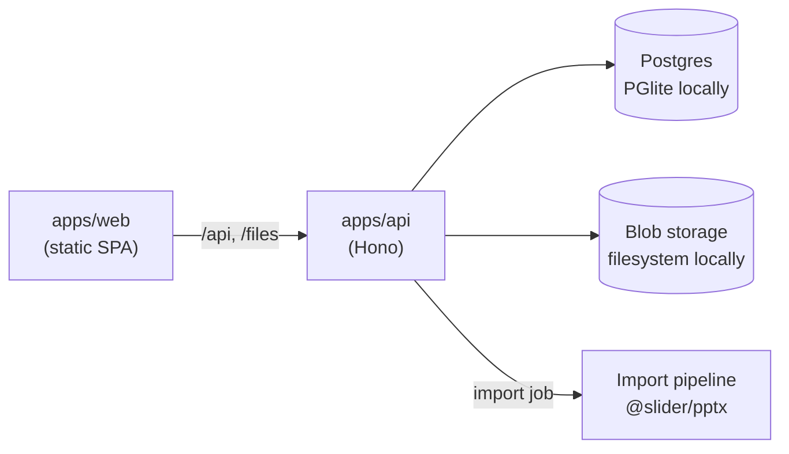

# Slider

**Feedback directly on the slide – click, mark, comment.** Every note sits on the exact spot it
is about: _slide + position_.

Drop in a PowerPoint (share link or `.pptx`) and invite your team into your organisation. They
click where something should change, draw a frame or an arrow, and write what they mean. You see
every note in place, reply, and tick it off. People outside the organisation get a view-only link –
no account needed. The original file is never changed – unless you,
the owner of a linked deck, add a slide with the ⊕ between two slides.

> **Status: first prototype (milestones M1 + M2).** Upload, parsing, preview rendering, the review
> viewer with pins/frames/freehand, threads, done-status, filters, PowerPoint comment import and
> guest links work end to end on your machine, and so does importing by link (direct `.pptx`
> URLs out of the box, OneDrive/SharePoint after a one-time Microsoft app registration – see
> [Link import](#link-import)). Linked decks update themselves when the PowerPoint changes – see
> [Automatic updates](#automatic-updates). Voice and video comments are recorded, compressed and
> transcribed on the device – see [Voice and video comments](#voice-and-video-comments).

## Quick start

Requirements: [Bun](https://bun.com) ≥ 1.3 (package manager and API runtime) and Node.js ≥ 22
(Vite and Vitest run on Node). Nothing else – the database is embedded.

```bash
bun install
bun run dev          # API on :8787, web app on http://localhost:5173
```

The first start creates an empty local database in `apps/api/.data`. To get a demo workspace
("Q4 Strategie" with feedback from four reviewers), run `bun run seed` – it wipes the database first.

Try the upload flow with the generated sample deck:

```bash
bun run sample       # writes packages/pptx/samples/slider-demo.pptx
```

| Command             | What it does                                   |
| ------------------- | ---------------------------------------------- |
| `bun run dev`       | API + web with hot reload                      |
| `bun run test`      | All unit and API tests (Vitest)                |
| `bun run lint`      | ESLint (TypeScript, React hooks)               |
| `bun run typecheck` | `tsc` for every workspace                      |
| `bun run build`     | Production build (`apps/web/dist` is static)   |
| `bun run seed`      | Reset the local database to the demo workspace |

> Use `bun run test`, not `bun test`: the suite runs on Vitest. `bun test` would start Bun's own
> test runner, so it is blocked with a hint (`bunfig.toml`).

## Architecture

```
apps/
  web/       Vite + React 19 + Tailwind 4 – static SPA (no SSR), talks to the API via /api
  api/       Hono on Bun – REST API, import pipeline, file serving
packages/
  shared/    Domain model + API contract (zod schemas → TypeScript types), geometry, link parsing
  pptx/      OOXML parser (slides, shapes, sections, modern + legacy comments) and SVG preview renderer
```



Design decisions worth knowing:

- **One contract, two sides.** `packages/shared` holds zod schemas for every entity and request.
  The API validates with them; the web app infers its types from them. No drift.
- **Normalised geometry.** Every anchor, frame and stroke is stored in 0–1 slide coordinates, so
  marks stay pixel-exact at any zoom level and screen size. Anchors also remember the shape they
  sit on (`cNvPr/@id`), so they can follow objects across revisions later.
- **Timeline zoom.** The zoom pill (and ⌘/Ctrl + wheel or pinch) only scales the horizontal
  slide row, from one big slide (Desktop-1) to several small ones side by side (Desktop-7). The
  active slide stays anchored at the left, and the comments simply start below the filmstrip.
  The zoom is remembered per browser.
- **Stable slide identity.** Slides get a Slider UUID and keep PowerPoint's `sldId`; URLs use the
  stable id (`/d/:deck?slide=:id`), never the slide number.
- **Real Postgres, zero setup.** Locally the API runs [PGlite](https://pglite.dev) (Postgres in
  WASM) through Drizzle. The same schema and migrations run on a hosted Postgres in production.
- **Adapters at the edges.** Blob storage, the job queue, the slide renderer and link sources are
  interfaces with a local implementation today (filesystem, in-process queue, Office/LibreOffice/SVG
  renderers, Microsoft Graph + plain HTTPS link sources) and S3 / pg-boss tomorrow.
- **Slides look like PowerPoint.** Linked decks are rendered by Office (Graph PDF export), uploads
  by LibreOffice (`soffice --headless --convert-to pdf`); pdf.js rasterises each page to a 2400 px
  WebP plus a 640 px thumbnail. Hidden slides, a page-count mismatch or a missing renderer fall
  back to the built-in SVG preview, whose hash also drives slide matching. `slide_versions.renderer`
  records which one drew each slide; decks from before a renderer was available are re-rendered
  in the background after start-up (once per revision), or via the deck's ⋯ menu
  ("Folienbilder neu erzeugen", `POST /api/decks/:id/rerender`). Locally:
  `brew install --cask libreoffice` (or set `LIBREOFFICE_PATH`).
- **The original stays untouched.** Slider only ever reads the PPTX. Guests see rendered slide
  images, never the file.

## Link import

Paste a link on the start page (`/neu`). Three kinds are recognised (`packages/shared/src/link.ts`):

| Link                                                                      | How Slider reads it                                                                                 | Login     |
| ------------------------------------------------------------------------- | --------------------------------------------------------------------------------------------------- | --------- |
| Any `https://…/deck.pptx` URL                                             | Downloads the file directly                                                                         | none      |
| SharePoint / OneDrive for Business (`*.sharepoint.com/:p:/…`, `Doc.aspx`) | Anonymous download first (`download=1`, works for "Anyone with the link"), else Graph `/shares/u!…` | if needed |
| OneDrive personal (`1drv.ms`, `onedrive.live.com`)                        | Follows the redirects to the `resid`, then Graph `/drives/{drive}/items/{resid}`                    | always    |

All downloads run server-side through `apps/api/src/sources/safe-fetch.ts`: https only, public IP
addresses only (re-checked on every redirect, max. 5), 60 s timeout, size limit while streaming,
and the file must start with the ZIP header `PK\x03\x04`.

**Microsoft login (one-time setup).** OneDrive and org-only SharePoint links need a delegated
Microsoft Graph token. Without one, the start page explains what is missing.

1. Entra admin center → _App registrations_ → _New registration_ "Slider", supported account
   types: _Accounts in any organizational directory and personal Microsoft accounts_.
2. _Authentication_ → _Add a platform_ → _Web_, redirect URI
   `http://localhost:5173/api/auth/microsoft/callback` (dev, through the Vite proxy) or
   `https://<your host>/api/auth/microsoft/callback`.
3. _Certificates & secrets_ → new client secret.
4. _API permissions_ → Microsoft Graph, delegated: `Files.Read.All`, `offline_access`, `User.Read`
   and (for signing in to Slider, BER-129) `openid`, `profile`, `email` – plus `Files.ReadWrite.All`
   for inserting slides (see below; asked for only on first use).
5. Copy `.env.example` to `.env` in the repo root, fill in `MS_CLIENT_ID`, `MS_CLIENT_SECRET`
   (optionally `MS_TENANT`, `MS_REDIRECT_URI`) and restart `bun run dev` – `.env` is only read at
   start-up.

The flow: the API answers `401 microsoft_login_required` with a `loginUrl` → "Mit Microsoft
anmelden" → Microsoft (authorization code + PKCE) → `/api/auth/microsoft/callback` stores the
refresh token AES-GCM-encrypted (key derived from `SLIDER_SECRET`) → back to `/neu?link=…`, which
retries the import automatically. If an organisation requires admin approval (AADSTS65001/90094),
the page says so; an admin grants consent once for the tenant.

## Automatic updates

Decks imported from a link follow their source (BER-107/108/114). Uploaded decks stay as they
are; a new version can be uploaded with `POST /api/decks/:id/revisions`.

- **Polling.** Every `SYNC_POLL_INTERVAL_MS` (default 2 min, `0` = off) the API process checks
  linked decks that someone opened or changed in the last 7 days. It asks only for the change
  token – Graph `cTag`/`eTag` for OneDrive/SharePoint, `ETag`/`Last-Modified` via `HEAD` for
  direct URLs; sources without either are downloaded and hashed at most every 5 intervals.
  An unchanged token never creates a revision, and a new token with identical bytes only
  records the token.
- **Debounce.** PowerPoint Online autosaves constantly, so a change is imported only after
  `SYNC_DEBOUNCE_MS` (default 1 min) without a further change – at the latest after 10 × that.
  The owner can skip the wait with "Jetzt aktualisieren" (`POST /api/decks/:id/sync`).
- **Slide matching.** The new revision is matched to the previous one (`@slider/pptx`
  `matchSlides`): same PowerPoint `sldId` first – even when the slide was completely rewritten –
  unless most ids disagree with the content (deck rebuilt/renumbered), then text, title, layout,
  neighbours and position with an optimal assignment. A slide deleted earlier that comes back
  with the same content is recognised and gets its old identity (and comments) back. Matched slides keep
  their Slider id, so comments simply stay on them; every slide gets `unchanged`, `moved`,
  `modified` or `new` with a confidence, stored as the revision's diff. Deleted slides keep
  their last image and all their comments – no comment ever disappears. With duplicated slides
  the original keeps its comments (including PowerPoint ones); the copy is new.
- **PowerPoint comments** are re-imported idempotently: edited text and statuses changed in
  PowerPoint are taken over, comments deleted in PowerPoint are flagged
  (`sourceStatus: "removed_in_pptx"`), never deleted, and replies written in Slider stay.
- **Errors** (expired Microsoft login, access revoked, file deleted, broken file, …) never touch
  the current revision; the deck's `sync.lastSyncError` carries a German banner text (and a
  login link). Unreachable sources show up only after three failures in a row; checks back off.

### Inserting slides

The ⊕ between two slides appears on hover. For the owner of a OneDrive/SharePoint deck it inserts
an empty slide right there – in the PowerPoint itself (BER-128, `POST /api/decks/:id/slides`);
for everyone else who may comment it starts a "hier fehlt eine Folie" comment. Uploaded decks
and plain URLs have nothing Slider could write to.

- **Minimal edit.** `@slider/pptx` `insertSlide` adds the slide with the layout (and the empty
  placeholders) of its neighbour and patches `presentation.xml`, its relationships, the content
  types, the sections and the slide count by string insertion; every other part stays as it was.
- **Never overwrites someone else's save.** The API reads the newest file with its `eTag`,
  inserts the slide and uploads with `If-Match`. If anyone saved in between, Graph answers 412,
  nothing is overwritten and the edit is redone on the newer file (up to three times).
- **No double import.** The uploaded file becomes the next revision right away (trigger
  `edit`) with Graph's new `cTag`, so the next poll sees no change.
- **Incremental consent.** Reading needs only `Files.Read.All`. The first insert asks for
  `Files.ReadWrite.All`: without that consent the API answers `microsoft_login_required` with a
  `loginUrl` (`…/login?access=write&returnTo=/d/:id?insertAfter=…`) and the web app sends the owner
  there once; back in the deck the insert finishes by itself. A refused consent returns to the
  deck with `msError` and a message instead.

For the web app: `GET /api/decks/:id/status` is a cheap poll (`revisionNumber`, `sync`),
`GET /api/decks/:id/revisions` lists versions with a summary ("3 Folien geändert, 1 neu,
1 gelöscht, 5 neue Kommentare aus PowerPoint"), `GET /api/decks/:id/revisions/latest/diff`
returns per-slide changes plus deleted slides with their comments, and every slide carries
`change`.

## Self-hosting

One container serves the API and the built web app. The published image needs nothing but its
public address:

```bash
docker run -d --name slider --restart unless-stopped -p 8787:8787 -v slider-data:/data \
  -e SLIDER_URL=https://slider.firma.de ghcr.io/root-bert/slider:edge
docker logs slider       # → https://slider.firma.de/einrichtung#token=…
```

The link in the log opens the setup page: e-mail (SMTP), Microsoft, Google or SSO login and
the admin's address, stored encrypted in the database; the server restarts itself to apply them.
The secret is generated into `/data`, the database is PGlite in `/data` unless `DATABASE_URL`
is set. Environment variables still work and win over the setup page. Put a reverse proxy with
HTTPS in front – or use `deploy/docker-compose.yml` (Caddy with automatic HTTPS + Postgres):

```bash
cd deploy
cp .env.example .env     # SLIDER_DOMAIN, POSTGRES_PASSWORD
docker compose up -d
```

A small VPS (2 vCPU, 4 GB) is enough for a team, at roughly 7 € a month and no per-user costs.
The image (amd64 + arm64) is built by `.github/workflows/image.yml`: `:edge` from `main`,
`:1.2.3`/`:1.2`/`:1`/`:latest` from `v*` tags.

Accounts are created on the first login (`SIGNUP=open`, the default; `invite` and `domains`
restrict that). Everything lives in organisations: every account may found one and join any
number by invitation. Organisations start on the free plan – 5 people (members plus pending
e-mail invites) and 3 decks; self-hosters lift or change that with `PLAN_FREE_MAX_MEMBERS` /
`PLAN_FREE_MAX_DECKS` (`0` = unlimited).

Without Docker: `bun run build`, then `NODE_ENV=production bun apps/api/src/server.ts`
(`bun run start`). `DATABASE_URL` switches from PGlite to a Postgres server; `GET /api/health`
checks the database. Step-by-step guide (German) with all variables, optional Authentik (OIDC),
backups, updates and costs: [docs/self-hosting.md](docs/self-hosting.md).

## Voice and video comments

Mic and camera in the tool bar (or the Audio/Video tabs of a new comment, or the icons beside any
reply field) record a comment of up to five minutes (BER-116).

- **Compressed on the device.** `MediaRecorder` records Opus at 24 kbit/s for voice (~180 KB per
  minute) and VP9 480p at 450 kbit/s for video (~3.5 MB per minute); Safari records MP4. The API
  stores the bytes as they are – no transcoding on the server.
- **Transcribed on the device.** After sending, the recording browser runs Whisper
  (`onnx-community/whisper-small`, ~250 MB, downloaded once from Hugging Face and then cached)
  in a Web Worker – WebGPU where available, else WebAssembly – detects the spoken language and
  sends only the text (`PUT /api/media/:id/transcript`). The audio never goes to a speech
  service. If the tab was closed before it finished, the author sees "Transkript erstellen".
  Another model can be set with `VITE_WHISPER_MODEL` in `apps/web/.env` (e.g.
  `onnx-community/whisper-base`, ~80 MB, weaker in German).
- **Stored in a folder of its own.** `MEDIA_DIR` (default `apps/api/.data/media`) can point at
  any folder, e.g. a synced one; keys are `decks/<deckId>/media/<uuid>.<webm|mp4|ogg>`, so
  deleting a comment or deck deletes its recordings. The store is the same `BlobStorage`
  interface as the slide files – Cloudflare R2 needs only another adapter.
- **5 GB per account.** `MEDIA_QUOTA_BYTES` (default 5 GB) counts every recording in a deck
  owner's decks, guests' recordings included, so a guest link cannot be used to fill the disk;
  `MAX_MEDIA_BYTES` (default 100 MB) limits one recording. The recorder shows the usage.
- **Served with a permission check.** `GET /api/media/:id` checks access to the deck on every
  request and supports `Range` (Safari needs it to play at all). The type is taken from the
  file's signature (WebM/MP4/Ogg), never from the upload.

## Roadmap

Tracked in Linear (project _Slider_). This prototype covers:

| Ticket          | Topic                                                         | State                                         |
| --------------- | ------------------------------------------------------------- | --------------------------------------------- |
| BER-89          | Monorepo, stack, one-command dev, CI                          | ✅ (deploy pending, BER-123)                  |
| BER-90          | Data model: deck, revision, slide, slide version, comment     | ✅                                            |
| BER-91          | `.pptx` upload with progress and error states                 | ✅                                            |
| BER-93          | PPTX parser: slide ids, order, hidden, sections, shapes, text | ✅                                            |
| BER-94          | Rendering: Office PDF (linked), LibreOffice (uploads), SVG    | ✅                                            |
| BER-95/96       | Viewer, filmstrip, counter, zoom, fullscreen, deep links      | ✅                                            |
| BER-97          | Import status and error states                                | ✅                                            |
| BER-98/99       | Pins, frames, freehand, arrow, highlighter                    | ✅                                            |
| BER-100/101     | Threads, connector lines, done status, filters                | ✅                                            |
| BER-102         | Guest review links (name only, revocable, expiring)           | ✅ view-only since BER-130                    |
| BER-103         | "A slide is missing here" gap comments                        | ✅                                            |
| BER-128         | ⊕ inserts a slide into the linked PowerPoint                  | ✅                                            |
| BER-112/113/115 | PowerPoint comments (modern + legacy) imported and labelled   | ✅                                            |
| BER-121         | Owner overview "Meine Reviews"                                | ✅ (login via Microsoft/magic link pending)   |
| BER-88/92       | Import by link: OneDrive, SharePoint, direct `.pptx` URL      | ✅                                            |
| BER-107/108/114 | Change detection, slide matching, PPT comment re-import       | ✅ API (polling, debounce, diff, manual sync) |
| BER-109–111     | Version UI: change badges, deleted slides, version history    | ⏳ API ready, UI pending                      |
| BER-116         | Voice and video comments, on-device transcription             | ✅                                            |
| BER-129         | Login (Microsoft, OIDC, magic link), organisations, invites   | ✅                                            |
| BER-130         | Open sign-up, free plan (5 people, 3 decks), view-only links  | ✅                                            |

## Contributing

Conventional commits, small PRs, `bun run lint && bun run typecheck && bun run test` before pushing.
The license is not decided yet (BER-122; AGPL-3.0 is the current recommendation).
