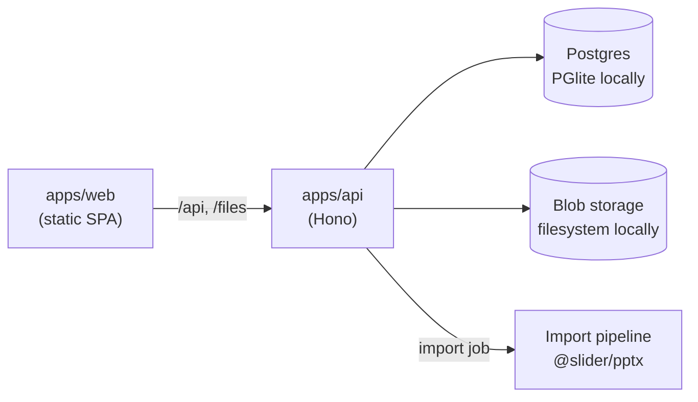

# Slider

**Review PowerPoint decks precisely – mark, comment, version.** Like Frame.io, but for slides:
where Frame.io has a timecode, Slider has _slide + position_.

Drop in a PowerPoint (share link or `.pptx`), invite reviewers with a link – no account needed –
and collect feedback pinned to the exact spot on the slide. The original file is never changed.

> **Status: first prototype (milestones M1 + M2).** Upload, parsing, preview rendering, the review
> viewer with pins/frames/freehand, threads, done-status, filters, PowerPoint comment import and
> guest links work end to end on your machine. Microsoft Graph links, versions/sync and media
> comments are next – see [Roadmap](#roadmap).

## Quick start

Requirements: Node.js ≥ 22. Nothing else – the database is embedded.

```bash
npm install
npm run dev          # API on :8787, web app on http://localhost:5173
```

The first start creates a local database in `apps/api/.data` and seeds a demo workspace
("Q4 Strategie" with feedback from four reviewers). Reset it any time with `npm run seed`.

Try the upload flow with the generated sample deck:

```bash
npm run sample -w @slider/pptx   # writes packages/pptx/samples/slider-demo.pptx
```

| Command             | What it does                                   |
| ------------------- | ---------------------------------------------- |
| `npm run dev`       | API + web with hot reload                      |
| `npm test`          | All unit and API tests (Vitest)                |
| `npm run lint`      | ESLint (TypeScript, React hooks)               |
| `npm run typecheck` | `tsc` for every workspace                      |
| `npm run build`     | Production build (`apps/web/dist` is static)   |
| `npm run seed`      | Reset the local database to the demo workspace |

## Architecture

```
apps/
  web/       Vite + React 19 + Tailwind 4 – static SPA (no SSR), talks to the API via /api
  api/       Hono on Node – REST API, import pipeline, file serving
packages/
  shared/    Domain model + API contract (zod schemas → TypeScript types), geometry, link parsing
  pptx/      OOXML parser (slides, shapes, sections, modern + legacy comments) and SVG preview renderer
```



Design decisions worth knowing:

- **One contract, two sides.** `packages/shared` holds zod schemas for every entity and request.
  The API validates with them; the web app infers its types from them. No drift.
- **Normalised geometry.** Every anchor, frame and stroke is stored in 0–1 slide coordinates, so
  marks stay pixel-exact at any zoom level and screen size. Anchors also remember the shape they
  sit on (`cNvPr/@id`), so they can follow objects across revisions later.
- **Stable slide identity.** Slides get a Slider UUID and keep PowerPoint's `sldId`; URLs use the
  stable id (`/d/:deck?slide=:id`), never the slide number.
- **Real Postgres, zero setup.** Locally the API runs [PGlite](https://pglite.dev) (Postgres in
  WASM) through Drizzle. The same schema and migrations run on a hosted Postgres in production.
- **Adapters at the edges.** Blob storage, the job queue, the slide renderer and link sources are
  interfaces with a local implementation today (filesystem, in-process queue, SVG preview,
  stub Graph adapter) and S3 / pg-boss / LibreOffice / Microsoft Graph tomorrow.
- **The original stays untouched.** Slider only ever reads the PPTX. Guests see rendered slide
  images, never the file.

## Roadmap

Tracked in Linear (project _Slider_). This prototype covers:

| Ticket          | Topic                                                         | State                                                 |
| --------------- | ------------------------------------------------------------- | ----------------------------------------------------- |
| BER-89          | Monorepo, stack, one-command dev, CI                          | ✅ (deploy pending, BER-123)                          |
| BER-90          | Data model: deck, revision, slide, slide version, comment     | ✅                                                    |
| BER-91          | `.pptx` upload with progress and error states                 | ✅                                                    |
| BER-93          | PPTX parser: slide ids, order, hidden, sections, shapes, text | ✅                                                    |
| BER-94          | Rendering                                                     | 🟡 SVG preview renderer; LibreOffice/PDF adapter next |
| BER-95/96       | Viewer, filmstrip, counter, zoom, fullscreen, deep links      | ✅                                                    |
| BER-97          | Import status and error states                                | ✅                                                    |
| BER-98/99       | Pins, frames, freehand, arrow, highlighter                    | ✅                                                    |
| BER-100/101     | Threads, connector lines, done status, filters                | ✅                                                    |
| BER-102         | Guest review links (name only, revocable, expiring)           | ✅                                                    |
| BER-103         | "A slide is missing here" gap comments                        | ✅                                                    |
| BER-112/113/115 | PowerPoint comments (modern + legacy) imported and labelled   | ✅                                                    |
| BER-121         | Owner overview "Meine Reviews"                                | ✅ (login via Microsoft/magic link pending)           |
| BER-88/92       | Microsoft Graph share links                                   | ⏳ link detection + adapter seam in place             |
| BER-107–111     | Change detection, slide matching, versions                    | ⏳ schema prepared (revisions, slide versions)        |
| BER-116         | Voice and video comments                                      | ⏳                                                    |

## Contributing

Conventional commits, small PRs, `npm run lint && npm run typecheck && npm test` before pushing.
The license is not decided yet (BER-122; AGPL-3.0 is the current recommendation).
